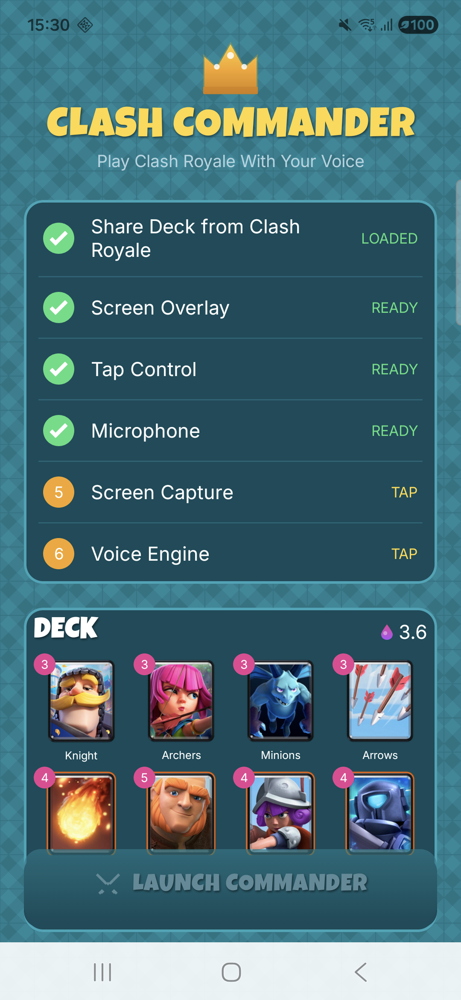

<p align="center">
  
</p>

# Clash Commander

**Play Clash Royale with your voice.** Five-tier AI command routing system combining on-device speech recognition, real-time computer vision, and cloud LLM strategic reasoning — running on a $300 mid-range Android phone.

Built solo in 48 hours for the [Supercell Global AI Game Hack](https://ailab.supercell.com/) (Feb 6-8, 2026).

---

## Download (Pre-Built APK)

**[Download Clash Commander v1.1 APK](https://github.com/youssofal/Clash-Commander/releases/download/v1.0.0/clash-commander-v1.1.apk)** (~456MB, includes all on-device models)

Just install and play — no build required. Voice commands work fully offline. Cloud features (Smart Path, Autopilot) require API keys in `local.properties` if building from source.

---

<p align="center">
  
</p>

---

## What It Does

Clash Commander is an Android overlay that sits on top of Clash Royale, listens to your voice, and plays cards for you. Say "knight left" and the card plays in under 200ms. Say "defend" and the AI picks the best defensive card. Say "autopilot" and the AI plays the entire match.

It's also an **accessibility tool** — enabling players with motor impairments to play Clash Royale competitively using only their voice.

## Five AI Technologies, One System

| Technology | What It Does | Where It Runs |
|-----------|-------------|---------------|
| **Zipformer STT** (sherpa-onnx) | Voice to text in ~160ms | On-device (CPU) |
| **Silero VAD** | Detects when you start/stop speaking | On-device (CPU) |
| **YOLOv8n-cls** | Identifies which cards are in your hand | On-device (PyTorch Mobile) |
| **Claude Opus 4.6** | Deep pre-match deck strategy analysis | Cloud (Anthropic API) |
| **Gemini 3 Flash** | Real-time tactical decisions during gameplay | Cloud (Google AI API) |

## Command Tiers

| Tier | Example | Latency | How It Works |
|------|---------|---------|-------------|
| **Fast Path** | "knight left", "fireball center" | ~170ms | On-device STT + parser + tap injection. No network. |
| **Queue Path** | "knight left then archers right" | ~170ms + wait | Buffers commands, auto-plays when card cycles into hand. |
| **Smart Path** | "defend", "follow up", "push right" | ~1.5s | Gemini Flash picks the optimal card using Opus playbook. |
| **Autopilot** | "autopilot" / "play for me" | ~4s/play | AI plays the entire match. Toggle on/off by saying "autopilot". |

## Quick Start (Pre-Built APK)

No build needed — just install and play. Voice commands work **fully offline**.

### Step 1: Install the APK

Download the APK from the [Releases page](https://github.com/youssofal/Clash-Commander/releases/tag/v1.0.0) and install it on your Android phone. You may need to allow "Install from unknown sources" in your settings.

> **Android 13+ users:** After installing, go to **Settings > Apps > Clash Commander > ⋮ (three dots) > Allow restricted settings**. This is required for the Overlay and Accessibility permissions to work.

### Step 2: Open the App and Complete the Checklist

When you open Clash Commander, you'll see a setup checklist with 6 items. Tap each one to set it up:

| # | Step | What to Do |
|---|------|------------|
| 1 | **Share Deck from Clash Royale** | Tap to open Clash Royale. Go to your battle deck, tap **Share**, and select **Clash Commander** from the share sheet. Your 8 cards will load into the app. |
| 2 | **Screen Overlay** | Tap to open system settings. Find **Clash Commander** and toggle **Allow display over other apps** ON. Press back to return. |
| 3 | **Tap Control** | Tap to open Accessibility settings. Find **Clash Commander**, tap it, and toggle it ON. Confirm the permission dialog. Press back to return. |
| 4 | **Microphone** | Tap to grant microphone permission. Select **Allow**. |
| 5 | **Screen Capture** | Tap to start screen capture. A system dialog will ask to record your screen — tap **Start now**. |
| 6 | **Voice Engine** | Tap to start the speech recognition engine. This loads the on-device AI model (~7 seconds). Wait until it shows **READY**. |

Once all 6 items show a green checkmark, the **LAUNCH COMMANDER** button at the bottom activates.

### Step 3: Launch and Play

1. Tap **LAUNCH COMMANDER** — a small floating overlay appears on screen
2. Tap **Listen** on the overlay to start voice recognition
3. Switch to Clash Royale and start a match
4. Say commands like **"knight left"** or **"fireball center"** — the AI places cards for you in ~170ms

### What Works Without API Keys

| Feature | Works Offline? | Example |
|---------|---------------|---------|
| **Fast Path** (direct card commands) | Yes | "knight left", "archers right", "fireball center" |
| **Queue Path** (chained commands) | Yes | "knight left then archers right" |
| **Smart Path** (AI tactical decisions) | No — needs Gemini API key | "defend", "push right" |
| **Autopilot** (full AI play) | No — needs Gemini API key | "autopilot", "play for me" |
| **Strategy Analysis** | No — needs Anthropic API key | Pre-match deck analysis |

> **Fast Path and Queue Path cover most gameplay.** You tell the app which card to play and where — it handles the tapping. No API keys required.

---

## Building from Source

If you want Smart Path, Autopilot, or strategy analysis, you need to build from source with API keys.

### Prerequisites

- Android Studio or Gradle
- Android phone (tested on Samsung Galaxy A35, Android 16)
- Clash Royale installed

### 1. Download STT Model Assets

The speech recognition model (~180MB) is too large for git. Run the bootstrap script:

**macOS / Linux:**
```bash
./scripts/bootstrap_sherpa_deps.sh
```

**Windows (PowerShell):**
```powershell
powershell -ExecutionPolicy Bypass -File .\scripts\bootstrap_sherpa_deps.ps1
```

### 2. Configure API Keys (Optional)

Copy the example and add your keys:
```bash
cp local.properties.example local.properties
```

Edit `local.properties`:
```properties
ANTHROPIC_API_KEY=sk-ant-...    # For deck strategy analysis (Claude Opus)
GEMINI_API_KEY=AIza...          # For Smart Path + Autopilot (Gemini Flash)
```

> Without keys, the app still works — Fast Path and Queue Path are fully on-device. Smart Path and Autopilot will show a friendly message asking for keys.

### 3. Build and Install

```bash
./gradlew assembleDebug
adb install -r app/build/outputs/apk/debug/app-debug.apk
```

Then follow the same setup checklist from Step 2 above.

## Architecture

```
Microphone -> Silero VAD -> Zipformer STT -> Command Parser -> Router
                                                                  |
                              +------------------+----------------+--------+
                              |                  |                |        |
                          FAST PATH         QUEUE PATH      SMART PATH  AUTOPILOT
                          (on-device)       (on-device)     (Gemini)    (Gemini)
                           ~170ms          ~170ms+wait       ~1.5s      ~4s/play
                              |                  |                |        |
                              +------------------+----------------+--------+
                                                  |
                                        AccessibilityService
                                          safeTap() / playCard()
                                                  |
                                           Clash Royale
```

**Pre-match:** Claude Opus 4.6 analyzes your deck and generates a strategic playbook (defense table, synergies, placement defaults). This playbook is injected into every Gemini Flash call as context.

**During match:** YOLOv8n-cls scans your hand at 5 FPS to identify which cards are available. The command router picks the fastest execution path for each voice command.

## Voice Commands

Say **"[card] [zone]"** to play a card. For example: **"knight left"**, **"fireball top right"**.

### Zones

| Zone | Where It Places | Aliases |
|------|----------------|---------|
| **left** | Left bridge | "left bridge", "bridge left" |
| **right** | Right bridge | "right bridge", "bridge right" |
| **center** | Center of arena | "middle", "mid" |
| **top left** | Enemy left tower | "left tower", "enemy left", "his left" |
| **top right** | Enemy right tower | "right tower", "enemy right", "his right" |
| **bottom left** | Behind your left tower | "back left", "behind left", "defend left" |
| **bottom right** | Behind your right tower | "back right", "behind right", "defend right" |
| **back** | Behind your king tower | "behind", "back center", "behind king" |
| **front left** | Offensive left (past bridge) | — |
| **front right** | Offensive right (past bridge) | — |
| **my left** | Your left princess tower | "my left tower" |
| **my right** | Your right princess tower | "my right tower" |
| **his king** | Enemy king tower | "their king", "opponent king" |

### Command Examples

```
"knight left"                  → plays Knight at left bridge
"fireball top right"           → plays Fireball at enemy right tower
"arrows center"                → plays Arrows at center
"giant bottom left"            → places Giant behind your left tower
"musketeer back"               → places Musketeer behind king tower
"mini pekka front right"       → places Mini P.E.K.K.A past right bridge
"archers my left"              → places Archers at your left tower
"knight left then archers right" → plays Knight, then queues Archers
"fireball his king"            → plays Fireball at enemy king tower
```

### Special Commands (require API keys)

```
"defend"                       → AI picks best defensive card
"push right"                   → AI picks offensive card for right lane
"follow up"                    → AI supports last played card, same lane
"autopilot" / "play for me"   → AI plays the entire match
"stop"                         → Stops autopilot
```

## Tech Stack

- **Language:** Kotlin
- **UI:** Jetpack Compose (Material 3) with Clash Royale-themed design system
- **STT:** sherpa-onnx with Zipformer Transducer (int8) + Silero VAD + hotword biasing
- **Hand Detection:** YOLOv8n-cls (103 card classes, 98.1% val accuracy, ~3ms inference)
- **Strategy:** Claude Opus 4.6 (pre-match) + Gemini 3 Flash (real-time)
- **Input Injection:** Android AccessibilityService with touch-state gating
- **Screen Capture:** MediaProjection API

## Known Issues

- **Android 15/16 gesture freeze:** If you touch the screen while a voice command is executing, the gesture system may freeze. Hands-free operation is recommended — that's the whole point.
- **STT accuracy:** Some card names are challenging for the model. Giant and Arrows have lower recognition rates. The system includes 180+ aliases and 70+ compound aliases for STT misrecognitions.
- **No elixir tracking:** The system doesn't read your elixir bar. Cards may fail to play if you don't have enough elixir.

## Project Structure

```
app/src/main/java/com/yoyostudios/clashcompanion/
├── MainActivity.kt              # Compose UI, permissions, deck loading
├── accessibility/
│   └── ClashCompanionAccessibilityService.kt  # Tap injection (safeTap)
├── capture/
│   └── ScreenCaptureService.kt  # MediaProjection frames
├── speech/
│   └── SpeechService.kt        # sherpa-onnx STT pipeline
├── detection/
│   ├── HandDetector.kt          # Background hand scanning at 5 FPS
│   └── CardClassifier.kt       # YOLOv8n-cls inference
├── command/
│   ├── CommandRouter.kt         # Five-tier routing + Autopilot
│   └── CommandParser.kt        # Fuzzy matching + alias resolution
├── strategy/
│   └── OpusCoach.kt            # Claude Opus deck analysis
├── api/
│   ├── GeminiClient.kt          # Gemini 3 Flash API
│   ├── AnthropicClient.kt      # Claude API wrapper
│   └── RoboflowClient.kt      # Roboflow vision API
├── deck/
│   └── DeckManager.kt          # Deck share link parsing
├── overlay/
│   └── OverlayManager.kt       # Floating overlay HUD
├── ui/                          # Compose theme + components
└── util/
    ├── Coordinates.kt           # 1080x2340 zone map (40+ aliases)
    └── CardAliases.kt          # 180+ card aliases for STT
```

## License

MIT

## Disclaimer

Hackathon prototype built for the Supercell Global AI Game Hack. Respect Supercell's Terms of Service. Use at your own risk.
